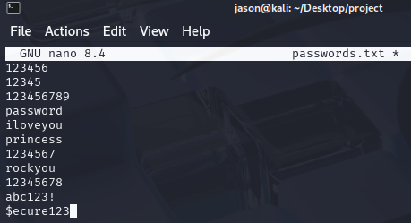
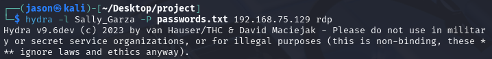

# Active Directory and SIEM Lab

## Objective

The Active Directory and SIEM Lab was designed to simulate a domain environment to monitor real-world attack scenarios and generate telemetry for security analysis. The project involved configuring Active Directory to manage user accounts, using Kali Linux for conducting brute-force attacks, integrating Splunk for centralized log ingestion and threat detection, and employing Atomic Red Team to emulate threats. 

### Skills Learned

- Configured Active Directory for user account provisioning
- Conducted brute-force attacks using Kali Linux to simulate an attack
- Configured Splunk to ingest and analyze security logs
- Utilized Atomic Red Team tests to emulate MITRE ATT&CK techniques
- Deep understanding of log sources and event types for threat detection

## Steps

To begin this lab, I created a logical diagram of the network that will host the Virtual Machines to better visualize the environment. I then set up Virtual Machines for the Active Directory Server, Splunk Server (Ubuntu), Windows 10 machine, and Kali Linux machine.

To ensure that the Splunk server can send logs, I created my own configuration named "inputs.conf" in the file: SplunkUniversalForwarder > etc > local > system. This will allow Splunk to send logs my newly created index named "endpoint". I am also using sysmon-modular for easier maintenance and specific configs.

The Splunk Universal Forwarder on my Windows 10 machine is sending data to the Splunk server through port 9997 (indexing port) which I enabled. I accessed Splunk through Windows 10 by typing the Splunk Server IP address followed by port 8000 (Splunk port) into my browser. In the search bar, I typed "index=endpoint" to find events related to that index. The screenshot shows that Splunk is successfully ingesting logs.

The next step is to configure the Active Directory. I created a forest which acts as a container for a domain. I gave the root domain name: jason.project.

To simulate an enterprise environment, I created an IT and HR department with a user in each department. 

 

In order to use the jason.project domain on the Windows 10 machine, I had to change its IPv4 settings by entering the IP address of the Active Directory into the DNS server.

I then joined the domain using Administrator credentials.

Once the system resets, I am able to sign in as one of the two users I created in AD through the JASON domain. 

Now, to simulate brute-force password attacks, I enabled Remote Desktop (RDP) for user John_Smith and Sally_Garza.

On Kali Linux, I created a filed named passwords.txt with common password names as well as the password of my target, Sally Garza. The password for this account is $ecure123.

To perform the brute force, I used the tool "Hydra", which supports many different protocols, like RDP. For the command, I use the -l flag to specify the user account I am targeting (Sally) and -P to try every password in passwords.txt. 

Once the command has been executed, Hydra verifies that the password has been found.

After obtaining the password of the user Sally, I checked Splunk to analyze the logs generated from the brute force attack. To see events relating to Sally's account, I typed: index="endpoint" Sally_Garza, and notice that events were showing.

To further analyze these events, I clicked on EventCode. This feature shows Windows Event IDs that identify events recorded in the Windows Event Log. The Event ID 4625 is the first one to show up, with a count of 12. Event ID 4625 refers to failed log-on attempts, showing the failed attempts from the passwords list. In the real-world, seeing an event like this with a high count is extremely suspicious. The following Event ID is 4624 and represents the account successfully logging on. It can be assumed that after the brute force attempts, the adversary successfully logged on to Sally's account. 

Splunk also provides network information, showing where exactly the source of the attack is coming from. In the screenshot, it shows the Kali Linux workstation, along with its IP address.

Using Atomic Red Team is great for emulating adversary attack techniques based on the MITRE ATT&CK framework. In the persistence technqiue category, there's a sub-category called "Create account" and "Local account". This technique allows adversaries to create a local account on a victim's system to maintain access. I used the command "Invoke-AtomicTest T1136.001" in PowerShell to emulate this technique.

I then checked Splunk to check events relating to "NewLocalUser". Thankfully, Splunk was able to capture this event. Atomic Red Team is very useful for testing what attacks can be detected or which ones can go undetected. As a security practicioner, it is crucial to discover what attacks your SIEM may be blind to.

