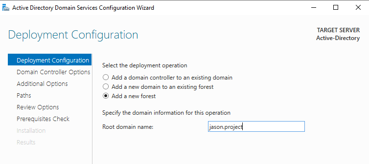

# Active Directory and SIEM Lab

## Objective

The Active Directory and SIEM Lab was designed to simulate a domain environment to monitor real-world attack scenarios and generate telemetry for security analysis. The project involved configuring Active Directory to manage user accounts, using Kali Linux for conducting brute-force attacks, integrating Splunk for centralized log ingestion and threat detection, and employing Atomic Red Team to emulate threats. 

### Skills Learned

- Configured Active Directory for user account provisioning
- Conducted brute-force attacks using Kali Linux to simulate an attack
- Configured Splunk to ingest and analyze security logs
- Utilized Atomic Red Team tests to emulate MITRE ATT&CK techniques
- Deep understanding of log sources and event types for threat detection

## Steps

To begin this lab, I created a logical diagram of the network that will host the Virtual Machines to better visualize the environment. I then set up Virtual Machines for the Active Directory Server, Splunk Server (Ubuntu), Windows 10 machine, and Kali Linux machine.

To ensure that the Splunk server can send logs, I created my own configuration named "inputs.conf" in the file: SplunkUniversalForwarder > etc > local > system. This will allow Splunk to send logs my newly created index named "endpoint". I am also using sysmon-modular for easier maintenance and specific configs.

The Splunk Universal Forwarder on my Windows 10 machine is sending data to the Splunk server through port 9997 (indexing port) which I enabled. I accessed Splunk through Windows 10 by typing the Splunk Server IP address followed by port 8000 (Splunk port) into my browser. In the search bar, I typed "index=endpoint" to find events related to that index. The screenshot shows that Splunk is successfully ingesting logs.

The next step is to configure the Active Directory. I created a forest which acts as a container for a domain. I gave the root domain name: jason.project.

To simulate an enterprise environment, I created an IT and HR department with a user in each department. 

 

In order to use the jason.project domain on the Windows 10 machine, I had to change its IPv4 settings by entering the IP address of the Active Directory into the DNS server.

I then joined the domain using Administrator credentials.

Once the system resets, I am able to sign in as one of the two users I created in AD through the JASON domain. 

Now, to simulate brute-force password attacks, I enabled Remote Desktop (RDP) for user John_Smith and Sally_Garza.

On Kali Linux, I created a filed named passwords.txt with common password names as well as the password of John Smith's account (P@ssw0rd123).

I used a common password cracking tool called Hydra, and input the corresponding information in the input fields, such as IP address, user name, protocol, and password name/password list. 

